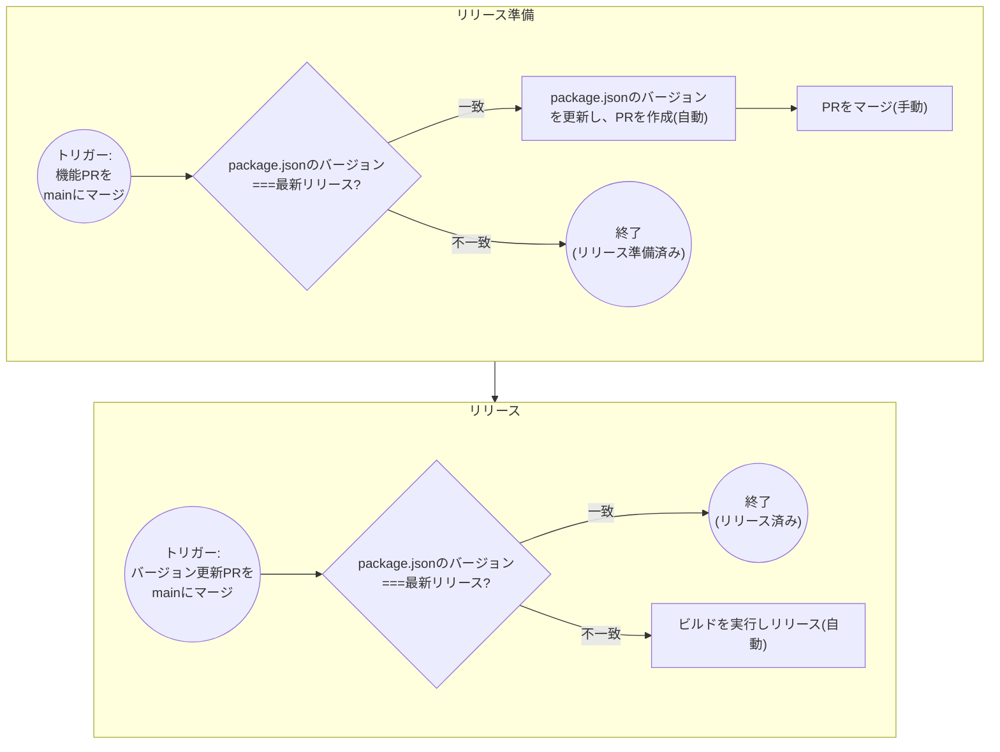

# @vallaboratory/mixway-shared-config

株式会社ヴァル研究所 mixway Teamが提供する、ESLint・TypeScript・dprintの共有設定ライブラリです。

mixway Team で利用する標準的なコーディング規約・フォーマット設定を一括で導入できます。

> [!NOTE]
> このライブラリは株式会社ヴァル研究所 mixway Team 向けに開発されたものです。社内利用を前提としており、社外での利用を保証するものではありません。\
> また、将来的にルールや設定が破壊的に変更される可能性があります。

## 特徴

- **ESLint設定** — TypeScript向けの厳格なルールセット（[Flat Config](https://eslint.org/docs/latest/use/configure/configuration-files)形式）
- **TypeScript設定** — `strict`モードをベースにした共通tsconfig
- **dprint設定** — TypeScript, JSON, Markdown, TOML, YAML, HTML/CSS等のフォーマッタ設定

## 前提条件

| ツール     | バージョン           |
| ---------- | -------------------- |
| Node.js    | 24.x（動作確認済み） |
| TypeScript | ≥ 5.9.0              |
| ESLint     | ≥ 10.0.0             |
| dprint     | 任意のバージョン     |

## インストール

```bash
# vX.Y.Zは任意のバージョンに置き換えてください
npm install --save-dev github:ValLaboratory/mixway-shared-config#vX.Y.Z
```

## 使用方法

### TypeScript（tsconfig.json）

プロジェクトルートの`tsconfig.json`で本パッケージの設定を継承します。

```json
{
    "extends": "@vallaboratory/mixway-shared-config/tsconfig",
    "compilerOptions": {
        "tsBuildInfoFile": "./node_modules/.cache/tsconfig.tsbuildinfo"
    }
}
```

### ESLint（eslint.config.ts）

[Flat Config](https://eslint.org/docs/latest/use/configure/configuration-files)形式でESLint設定を作成します。

```javascript
import { defaultRuleSets } from "@vallaboratory/mixway-shared-config/eslint";
import { defineConfig } from "eslint/config";

export default defineConfig([
    defaultRuleSets(),
    {
        rules: {
            // プロジェクト固有のルールをここに追加
        },
    },
]);
```

### dprint（dprint.json）

プロジェクトルートの`dprint.json`で本パッケージの設定を継承します。

```json
{
    "extends": "./node_modules/@vallaboratory/mixway-shared-config/dist/dprint/dprint.json"
}
```

## 開発

### commands

```shell
# フォーマット
npm run fmt
# フォーマットチェック
npm run fmt:check
# 型チェック
npm run check
# リント
npm run lint
# ビルド
npm run build
```

### Release Flow

#### 1. 開発ブランチをマージ

開発を行い、プルリクエストをmainブランチへマージします。

| package.jsonのバージョン | 最新リリースのバージョン |
| ------------------------ | ------------------------ |
| `1.0.0`                  | `1.0.0`                  |

#### 2. package.jsonのバージョンを更新

mainブランチが更新された後、package.jsonのバージョンと最新リリースのバージョンが同じ(`1.0.0`===`1.0.0`)場合は、package.jsonのバージョンを更新するPRが自動で作成されます。<br>
このPRをマージ(手動)すると、次のリリースステップに進みます。

> [!NOTE]
> 手動でpackage.jsonのバージョンを更新し、PRを作成することも可能です。

| package.jsonのバージョン | 最新リリースのバージョン |
| ------------------------ | ------------------------ |
| `1.1.0`                  | `1.0.0`                  |

#### 3. リリース(自動)

mainブランチが更新された後、package.jsonのバージョンと最新リリースのバージョンが異なる(`1.1.0`!==`1.0.0`)場合は、自動でビルドとリリースを行います。

| package.jsonのバージョン | 最新リリースのバージョン |
| ------------------------ | ------------------------ |
| `1.1.0`                  | `1.1.0`                  |



### 依存関係について

package.jsonの依存関係は以下のように指定します。

| 種別               | 用途                                                                                                                                    |
| ------------------ | --------------------------------------------------------------------------------------------------------------------------------------- |
| `dependencies`     | 通常の依存関係                                                                                                                          |
| `peerDependencies` | 利用者側とバージョンを合わせる必要がある依存関係（eslint, typescript, dprint等）。開発時にも利用するため`devDependencies`にも追加が必要 |
| `devDependencies`  | 開発に必要な依存関係                                                                                                                    |
